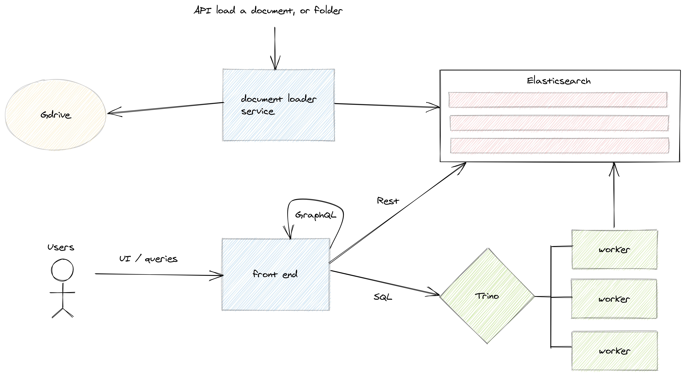

# word-analyzer

Index .pdf|.docx documents using Elasticsearch and an ingestion data pipeline and the *ingest-attachment* bash plugin.

Do some analysis, expose example api and web pages.



Also see:
- https://github.com/eformat/document-loader-service

## Example usage

Run elastic stack locally
```bash
podman-compose up -d
```

Run application
```bash
mvn quarkus:dev
```

## Run on OpenShift

Create project
```bash
oc new-project engagements-dev
```

Elasticsearch deployed from [HERE](https://github.com/eformat/document-loader-service/tree/main/elastic)

Create Secrets
```bash
oc -n engagements-dev create secret generic word-analyzer \
  --from-literal=elastic-password=$(oc get secret engagements-es-elastic-user -o=jsonpath='{.data.elastic}' | base64 -d)
```

Deploy application
```bash
helm repo add eformat https://eformat.github.io/helm-charts
helm upgrade --install word-analyzer eformat/word-analyzer --namespace engagements-dev 
```

Note: the engagements list is created separately and not checked in e.g.
```bash
oc apply -f ~/tmp/engagement-list-cm.yaml
```

## Generate Trino query

[Trino](https://trino.io/) querying onto [Elasticsearch](https://trino.io/docs/current/connector/elasticsearch.html)

Trino/ODH deployed from [HERE](https://github.com/eformat/document-loader-service/tree/main/odh)

```bash
./trino-query-practices.pl > trino-query-practices.sql
trino --server https://$(oc -n opendatahub-trino get route trino-route --template='{{ .spec.host }}') -f trino-query-practices.sql
```
